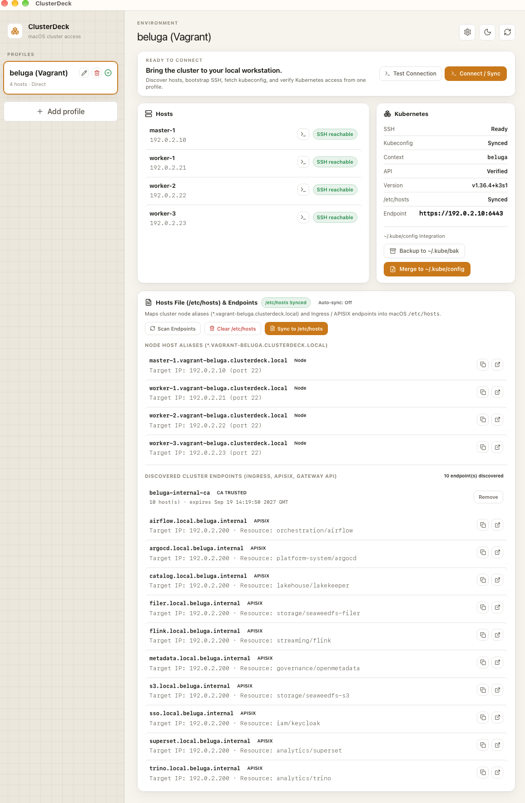
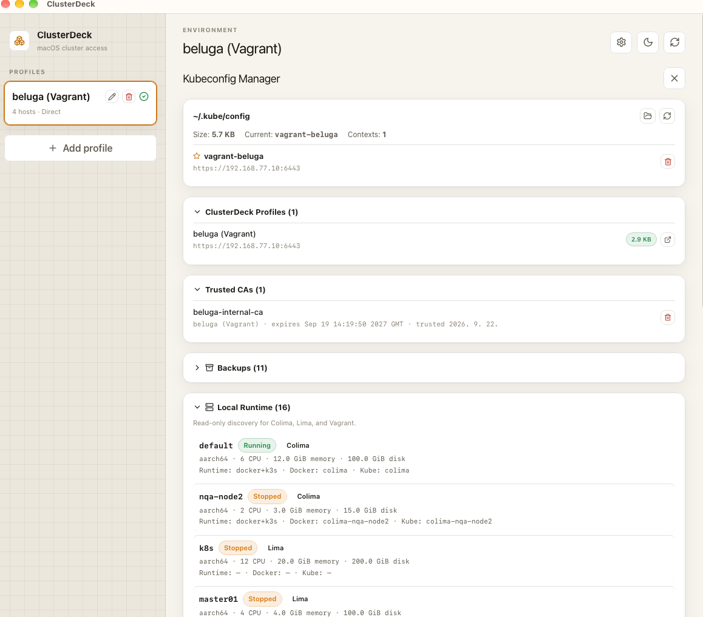
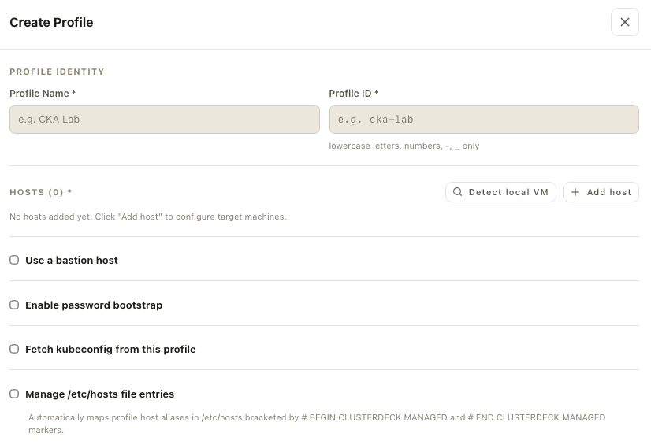

# ClusterDeck

> VM 및 Kubernetes 환경을 빠르게 발견하고 SSH/kubeconfig를 자동 연결하는 macOS 중심 데스크톱 도구

[English](README.md) | **한국어**

ClusterDeck은 VM과 Kubernetes 환경을 자주 생성·삭제·재생성하면서 IP가 변경되는 환경을 대상으로 한다. 사용자는 IP 대신 사람이 기억하기 쉬운 Profile 이름을 유지하고, ClusterDeck이 SSH 접속, 선택적 SSH 키 bootstrap, Bastion/ProxyJump, 원격 kubeconfig 가져오기, Kubernetes 연결 확인을 자동화한다.

## 현재 상태

ClusterDeck은 현재 **초기 MVP / 소스 중심 프로젝트**다. 저장소에서 확인되는 핵심 범위는 Profile, SSH, Bastion/ProxyJump, kubeconfig 가져오기·정규화, Kubernetes 연결 확인으로 이어지는 Workstation Access 흐름이다.

현재 신규 사용자의 기본 경로는 Tauri 기반 소스 실행이다. 패키지 앱 배포, 대규모 Fleet 관리, 일반적인 Kubernetes 관리자 콘솔 기능은 Release나 저장소 문서에서 명시적으로 검증되기 전까지 구현 완료 기능으로 간주하지 않는다.

GitHub Actions release pipeline(`.github/workflows/release.yml`)이 추가되었다: `v*` tag를 push하면 macOS `.dmg`를 빌드(ad-hoc 서명 — 아직 Apple Developer ID 인증서가 없어 최초 실행 시 "unidentified developer" 경고가 표시됨)하고 **draft** GitHub Release로 연다. 이 파이프라인으로 아직 실제 Release가 게시된 적은 없으므로, 패키지 앱 배포는 여전히 확립된 경로가 아니며 현재는 소스 실행이 유일하게 지원되는 방법이다.

## ClusterDeck이 Mac에서 변경하는 것

ClusterDeck은 자체 데이터 디렉터리(`~/.clusterdeck/`) 밖의 무언가를 건드리기 전에 반드시 macOS 권한 승인을 요청한다. 소유하지 않은 파일을 통째로 덮어쓰지 않으며, 명확히 표시된 블록 안에만 쓰고 그 외의 내용은 그대로 둔다. 구체적으로:

- **로그인 키체인(CA 인증서)** — 클러스터의 내부 CA를 신뢰하기로 선택하면(발견된 엔드포인트별 opt-in 동작, 또는 설정 → Trusted CAs에서), ClusterDeck은 그 인증서를 **로그인 키체인**(System 키체인이 아님)에 추가하며, SSL/TLS 신뢰 정책으로만 범위를 제한한다. 매번 macOS 자체 인증 프롬프트(암호 또는 Touch ID)가 뜬다. 신뢰된 항목은 언제든 Keychain Access.app에서 확인할 수 있고, ClusterDeck 자체(설정 → Trusted CAs, 또는 신뢰된 엔드포인트의 "제거" 동작)에서도 제거할 수 있다 — 둘 다 로컬에서 그냥 잊어버리는 게 아니라 인증서를 실제로 신뢰 해제한다.
- **`/etc/hosts`** — 기본값은 비활성화이며 Profile별 opt-in이다. 활성화하면 ClusterDeck은 클러스터 내부 도메인 항목을 하나의 표시된 블록(`# >>> ClusterDeck BEGIN (profile: <id>) >>>` … `# <<< ClusterDeck END (profile: <id>) <<<`) 안에만 macOS 관리자 권한 프롬프트를 통해 작성한다. 해당 프로필의 자기 블록만 편집한다.
- **`~/.ssh/config`** — ClusterDeck은 `Include ~/.clusterdeck/ssh/*.conf` 한 줄만 추가하고, 프로필별 SSH 옵션은 그 include된 디렉터리 안에 보관한다. 사용자의 config 파일에 직접 쓰지 않는다.

ClusterDeck이 추가한 모든 것을 제거하고 싶다면: Keychain Access.app(또는 ClusterDeck 자체 설정)에서 CA 신뢰를 해제하고, opt-in했다면 `/etc/hosts`의 표시된 블록을 삭제하고, `~/.ssh/config`에서 `Include` 줄을 제거하고, `~/.clusterdeck/`를 삭제하면 된다.

## 핵심 흐름

```text
IP / Host 검색
      ↓
SSH 연결 확인
      ↓
SSH Bootstrap (선택)
      ↓
SSH Alias / ProxyJump
      ↓
원격 kubeconfig 가져오기
      ↓
kubeconfig 정규화
      ↓
로컬 Profile
      ↓
Kubernetes 연결 확인
```

## 스크린샷

**연결된 Profile** — 동기화된 프로필의 SSH/kubeconfig/Kubernetes 상태와, 발견된 클러스터 엔드포인트 및 CA 신뢰 상태:



**설정** — 신뢰된 CA 목록과 Colima/Lima/Vagrant용 읽기 전용 Local Runtime 검색 섹션:



**새 Profile 생성** — 호스트 검색과 opt-in 방식의 bastion / bootstrap / kubeconfig / `/etc/hosts` 설정:



## 초기 범위

- macOS 중심 데스크톱 앱
- Tauri 2 + Rust 백엔드
- React + TypeScript 프론트엔드
- 멀티 VM Host Profile
- SSH 공개키 bootstrap 및 alias 관리
- Bastion / ProxyJump
- 원격 kubeconfig fetch 및 정규화
- `kubectl` 기반 연결 확인
- Colima, VirtualBox, VMware Fusion, Vagrant 로컬 VM 인벤토리 관찰
- 감지된 멀티노드 VM 환경 기반 원클릭 프로필 생성
- 하이퍼바이저 설치 없이 사용 가능한 인앱 Demo 모드

ClusterDeck은 일반적인 Kubernetes 관리자 콘솔을 목표로 하지 않는다.

## 인프라 및 VM 인벤토리 (Infrastructure & VM Inventory)

ClusterDeck은 기존 InfraDeck에서 개발되었던 멀티 프로바이더 VM 인벤토리 관찰 기능을 통합하였다([ADR-0008](docs/adr/0008-vm-inventory-environment-source.md)). 로컬 VM 및 환경을 관찰하고, 자원 할당량(CPU, RAM, 디스크 GiB 단위)을 종합 표시하며, 발견된 환경에서 "클러스터 설정" 클릭 한 번으로 접속 가능한 Profile을 즉시 자동 저장한다.

### 프로바이더 지원 현황

사용하는 프로바이더만 설치하면 된다. ClusterDeck은 읽기 전용 및 제한된 실행(10초 타임아웃, 2 MiB 버퍼 제한, 셸 미사용)으로 인벤토리를 조회한다.

| Provider | Discovery source | Current data | Limitations |
| --- | --- | --- | --- |
| Colima | `colima list --json` | Profile, 상태, CPU, RAM, 디스크 용량, 데이터 디스크 사용량, 생성 시각, advertised address | Kubernetes 상태는 아래 공통 감지를 따른다 |
| VirtualBox | `VBoxManage list vms`, `showvminfo`, `showmediuminfo`, `guestproperty` | 등록된 VM, UUID, 상태, CPU, RAM, 디스크 용량/사용량, 생성 시각; 실행 중일 때 게스트 IP | 게스트가 IP를 보고할 때만 표시 |
| VMware Fusion | 번들 `vmrun -T fusion list`, VMX 파일 | 실행 중인 VM, CPU, RAM, VMDK 디스크 용량/사용량, 생성 시각; `getGuestIPAddress`로 게스트 IP | 정지된 독립 VM은 목록에 없음; IP는 VMware Tools 실행 필요 |
| Vagrant | `vagrant global-status`, `.vagrant/.../id`, `vagrant ssh-config` | 프로젝트, 상태, orchestrator/runtime 관계; VMware의 VMX/디스크 데이터; 고정 IP 또는 ssh-config 주소 | 프로젝트 디렉터리 또는 `.vagrant` 데이터가 사라진 항목은 `stale`로 표시; 미지원 provider는 건너뜀 |

IP가 있는 머신의 Kubernetes 상태는 kubeconfig server 호스트와 6443 포트에 대한 500 ms TCP probe로 판단한다(`kubeconfig server`, `API server reachable (6443)`, `not detected`, IP가 없으면 `unknown`). 자격 증명은 읽지 않는다.

> **독립형 CLI 관련 안내:** 기존 `infradeck` 독립형 CLI는 ClusterDeck 백엔드로 흡수되면서 공개 Rust 라이브러리 크레이트 API가 불필요하게 확장되는 것을 방지하기 위해 별도 바이너리로는 제공되지 않는다. 예제 인벤토리 확인은 데스크톱 앱 내의 **Demo 모드**를 통해 직접 이용할 수 있다.

## 첫 성공 기준 (First Verified Success)

앱이 실행되는 것만으로는 성공으로 보지 않는다. 하나의 Profile이 아래 세 단계를 모두 통과했을 때 **첫 성공**으로 본다.

1. **SSH** — 직접 접속 또는 Bastion을 통해 선택한 Host에 실제로 도달한다.
2. **kubeconfig** — 원격 kubeconfig를 가져와 로컬 Profile용으로 정규화하며, credential을 로그나 공개 문서에 노출하지 않는다.
3. **Kubernetes API** — 정규화된 context로 `kubectl get nodes`와 같은 실제 API 호출에 성공한다.

개발 중 수동 교차 검증 예시는 다음과 같다.

```bash
ssh <profile-host> true
kubectl --context <normalized-context> get nodes
```

SSH는 성공했지만 Kubernetes API가 실패하면 완전한 Profile 성공이 아니라 부분 연결로 취급한다. Discovery, SSH bootstrap, kubeconfig 처리, Kubernetes 검증 사이의 책임 경계는 Architecture와 MVP Design 문서를 참고한다.

## 보안

공개 저장소이므로 실제 IP, hostname, 비밀번호, private key, kubeconfig, token, 인증서 등을 문서·이슈·테스트·스크린샷에 포함하지 않는다.

## 개발

```bash
pnpm install
pnpm tauri dev
```

검증:

```bash
pnpm build
cargo check --manifest-path src-tauri/Cargo.toml
```

## 문서 안내

- [Architecture](docs/ARCHITECTURE.md) — Workstation Access 계층과 책임 경계
- [MVP Design](docs/03-mvp-design.md) — MVP 동작과 설계 상세
- [Contributing](CONTRIBUTING.md) — 기여 절차
- [Security](SECURITY.md) — 보안 정책과 취약점 제보
- [Repository Engineering Rules](AGENTS.md) — 저장소 엔지니어링 계약

현재 코드와 오래된 설계 문서가 충돌하면 현재 소스와 명시적으로 검증된 동작을 우선한다. 아키텍처 경계가 바뀌면 관련 설계 문서도 같은 변경에서 갱신한다.

## 기여 / 피드백

IP가 자주 바뀌는 VM, Bastion, 원격 kubeconfig 환경에서의 외부 피드백이 특히 유용하다. 재현 가능한 실패는 GitHub Issues로 제보하되 실제 내부 인프라 정보는 제거한다.

## License

Apache License 2.0. [LICENSE](LICENSE) 참조.
