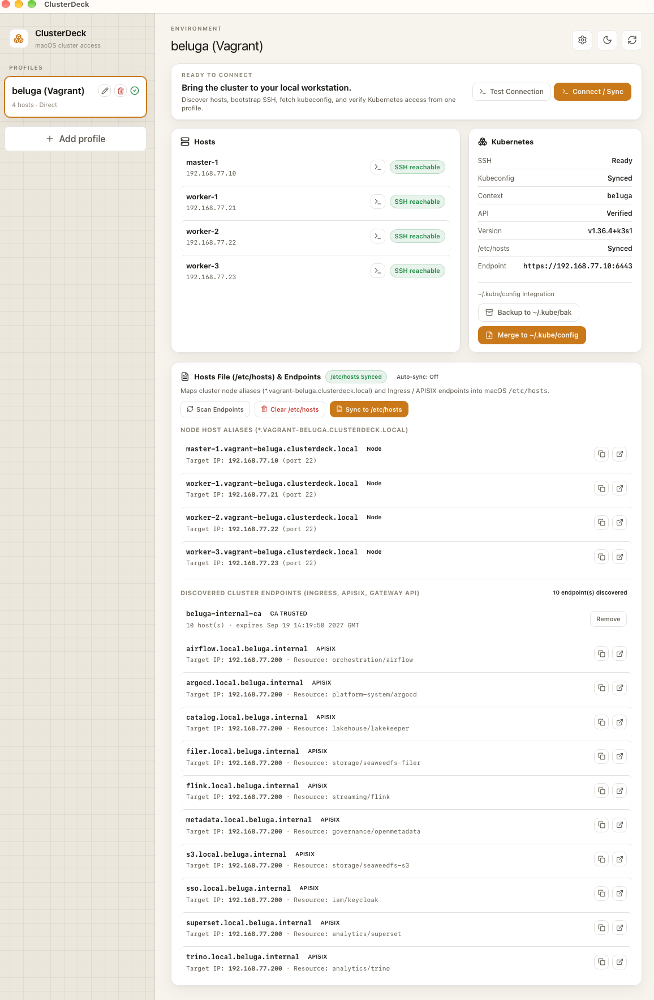
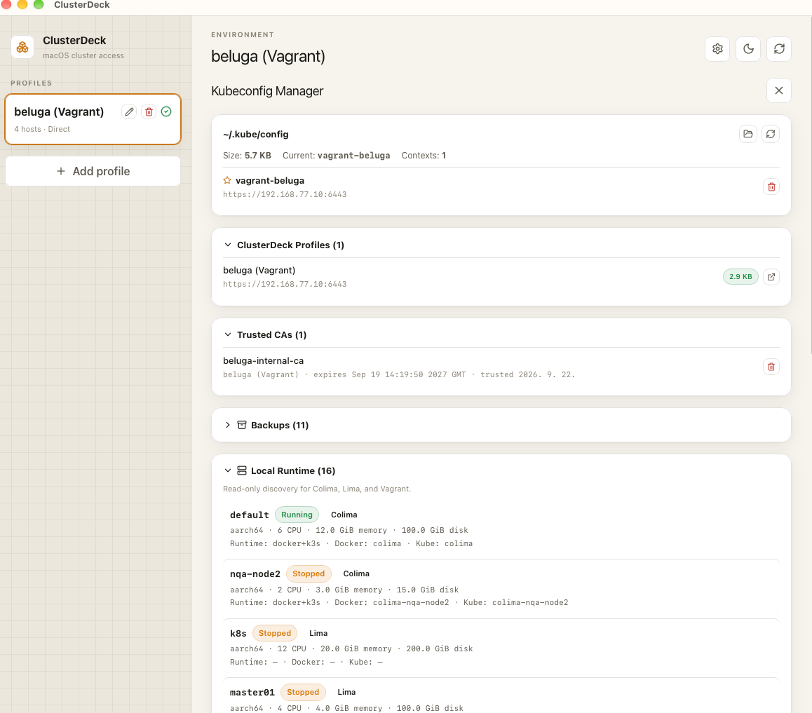
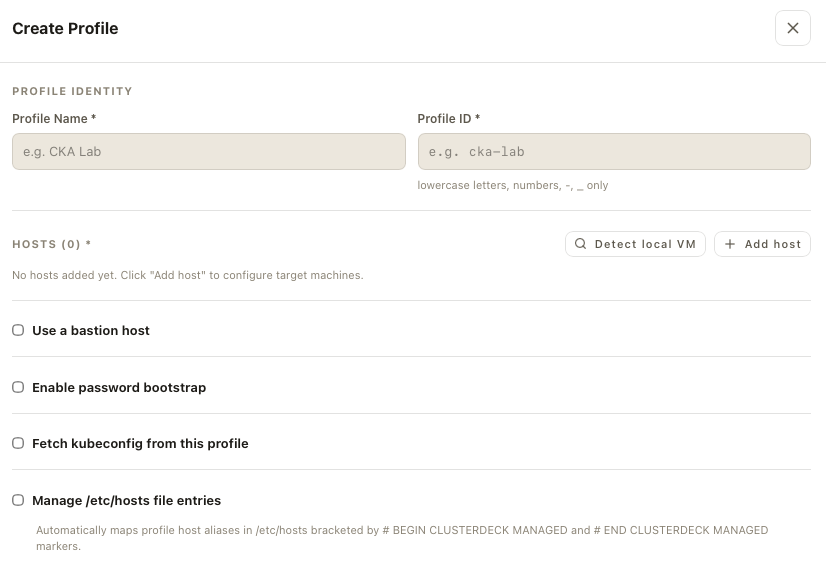

# ClusterDeck

> A lightweight macOS-first desktop app for discovering, bootstrapping, and connecting to VM and Kubernetes environments.

**English** | [한국어](README-ko.md)

ClusterDeck is designed for environments that are frequently created, deleted, or re-addressed. It keeps a human-friendly Profile name stable while automating SSH access, optional SSH key bootstrap, Bastion/ProxyJump access, remote kubeconfig retrieval, and Kubernetes connectivity verification.

## Current Status

ClusterDeck is an **early MVP / source-first project**. The repository currently documents and implements the workstation-access flow around Profiles, SSH, bastion/ProxyJump, kubeconfig retrieval/normalization, and Kubernetes connectivity checks.

The supported first-time path is development from source with Tauri. Do not treat packaged-app distribution, broad fleet management, or a general Kubernetes administration console as established product capabilities unless a release or repository documentation explicitly says so.

A GitHub Actions release pipeline now exists (`.github/workflows/release.yml`): pushing a `v*` tag builds a macOS `.dmg` (ad-hoc signed — there is no Apple Developer ID certificate yet, so macOS shows an "unidentified developer" warning on first launch) and opens it as a **draft** GitHub Release. No release has been published from this pipeline yet, so packaged-app distribution is still not an established path — development from source remains how to run ClusterDeck today.

## What ClusterDeck Changes on Your Mac

ClusterDeck asks macOS for permission before touching anything outside its own data directory (`~/.clusterdeck/`). It never overwrites a file it doesn't own — it only ever writes inside a clearly marked block and leaves everything else in that file untouched. Specifically:

- **Login Keychain (CA certificates)** — when you choose to trust a cluster's internal CA (an opt-in action per discovered endpoint, or from Settings → Trusted CAs), ClusterDeck adds that certificate to your **login keychain** (never the System keychain), scoped only to the SSL/TLS trust policy. macOS will show its own authorization prompt (password or Touch ID) each time. You can inspect what's trusted in Keychain Access.app at any time, or remove it from ClusterDeck itself (Settings → Trusted CAs, or the "Remove" action on a trusted endpoint) — both properly untrust the certificate rather than just forgetting it locally.
- **`/etc/hosts`** — off by default, opt-in per Profile. When enabled, ClusterDeck writes cluster-internal domain entries inside a single marked block (`# >>> ClusterDeck BEGIN (profile: <id>) >>>` … `# <<< ClusterDeck END (profile: <id>) <<<`) via a macOS admin-privileged prompt. It only ever edits its own block for that profile.
- **`~/.ssh/config`** — ClusterDeck adds one `Include ~/.clusterdeck/ssh/*.conf` line and keeps its own per-profile SSH options in that included directory, rather than writing directly into your config.

If you ever want to remove everything ClusterDeck has added: untrust its CAs from Keychain Access.app (or ClusterDeck's own Settings), delete the marked block(s) from `/etc/hosts` if you opted in, remove the `Include` line from `~/.ssh/config`, and delete `~/.clusterdeck/`.

## Core Flow

```text
IP / Host Discovery
        ↓
SSH Connectivity
        ↓
SSH Bootstrap (optional)
        ↓
SSH Alias / ProxyJump
        ↓
Remote kubeconfig Fetch
        ↓
kubeconfig Normalization
        ↓
Local Profile
        ↓
Kubernetes Connectivity Check
```

## Screenshots

**Connected profile** — SSH/kubeconfig/Kubernetes status for a synced profile, plus discovered cluster endpoints with their CA trust status:



**Settings** — trusted CAs and the read-only Local Runtime discovery section for Colima/Lima/Vagrant:



**New profile** — host discovery and the opt-in bastion / bootstrap / kubeconfig / `/etc/hosts` settings:



## Initial Scope

- macOS-first desktop application
- Tauri 2 + Rust backend
- React + TypeScript frontend
- Multi-VM host Profiles
- SSH key bootstrap and alias management
- Bastion / ProxyJump support
- Remote kubeconfig fetch and normalization
- `kubectl` connectivity verification

ClusterDeck is not intended to become a general Kubernetes administration console.

## First Verified Success

For a new environment, the product outcome is not merely that the desktop app starts. A Profile has reached **first verified success** when the same workflow proves all three layers:

1. **SSH** — ClusterDeck can reach the selected host, directly or through the configured bastion.
2. **kubeconfig** — the remote kubeconfig is fetched and normalized into the local Profile without exposing credentials in logs or documentation.
3. **Kubernetes API** — the resulting context can make a real API call such as `kubectl get nodes`.

A useful manual cross-check while developing is:

```bash
ssh <profile-host> true
kubectl --context <normalized-context> get nodes
```

If SSH succeeds but the Kubernetes API fails, treat that as a partial connection rather than a successful Profile. See the architecture and MVP design documents for the boundary between discovery, SSH bootstrap, kubeconfig handling, and Kubernetes verification.

## Development

```bash
pnpm install
pnpm tauri dev
```

Validation:

```bash
pnpm build
cargo check --manifest-path src-tauri/Cargo.toml
```

## Documentation Map

- [Architecture](docs/ARCHITECTURE.md) — workstation access layers and component boundaries
- [MVP Design](docs/03-mvp-design.md) — intended MVP behavior and design detail
- [Contributing](CONTRIBUTING.md) — contribution workflow
- [Security](SECURITY.md) — vulnerability reporting and security policy
- [Repository Engineering Rules](AGENTS.md) — repository-local engineering contract

When an implementation detail and an older design note disagree, current source and explicitly verified behavior take precedence; update the design document in the same change when the architecture boundary changes.

## Public Repository Safety

This is a public repository. All examples, tests, screenshots, and documentation must use placeholder infrastructure data only. Never commit passwords, private keys, bearer tokens, kubeconfigs, certificates, or real internal addresses.

## Contributing / Feedback

External feedback is especially useful for environments with changing VM addresses, bastions, and remote kubeconfigs. Report reproducible failures through GitHub Issues and include only sanitized infrastructure details.

## License

Apache License 2.0. See [LICENSE](LICENSE).
